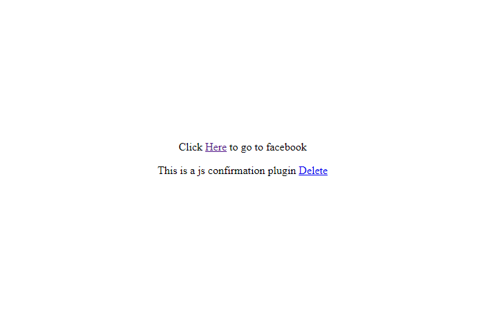

# JS Popup Confirmation plugin
### This is jquery plugin that helps to in force confirmation on click of html element.
To use it you just have to include jQuery and a copy of popup_confirmation plugin in your head or footer:

```html
<script type="text/javascript" src="http://code.jquery.com/jquery-latest.js"></script>
<script src="../confirmation.js"></script>
```

#### Attributes
| Attribute | Description |
| --- | --- |
| confirmation-title | Title to be displayed on pop up confirmation header.|
| confirmation-message | Mesage to be diplay on pop up confirmation body.|

#### Events
| Event |Parameters | Description |
| --- | --- | --- |
| onClick | id , Event| Fires when pop up confirmation button is click |

#### Example 

```html
<p>Click <a href="https://www.facebook.com/" class="confirmation" confirmation-title='Confirmation' confirmation-message='Do you want to go to facebook ?'>Here</a> to go to facebook</p>
```
#### Initialization

```html
 $('.confirmation').confirmation({
      onClick: function(id, event) {
          //
      }
  });
```

#### Demo

